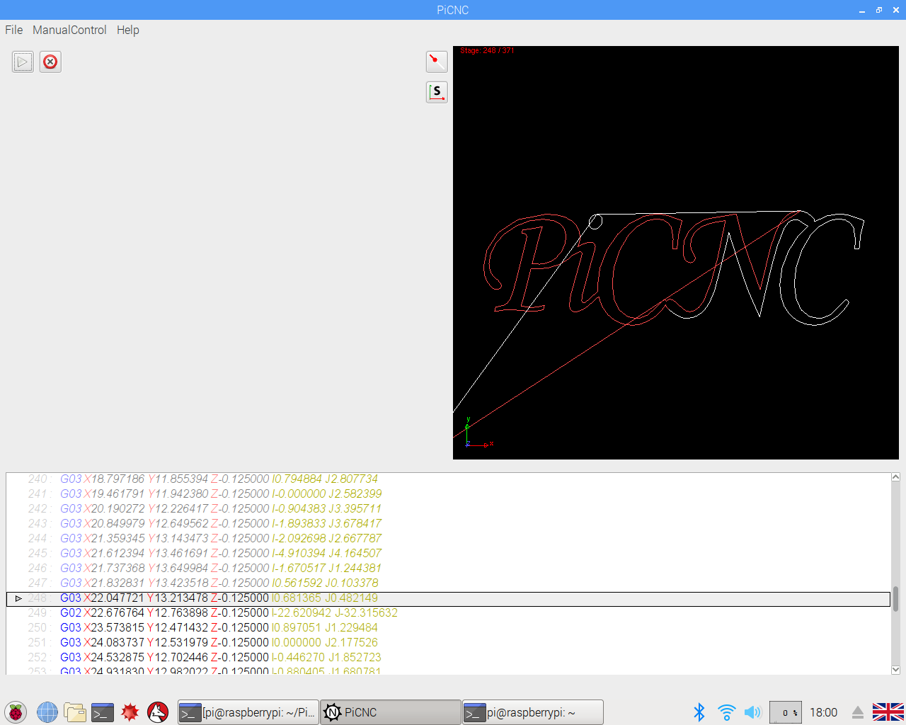
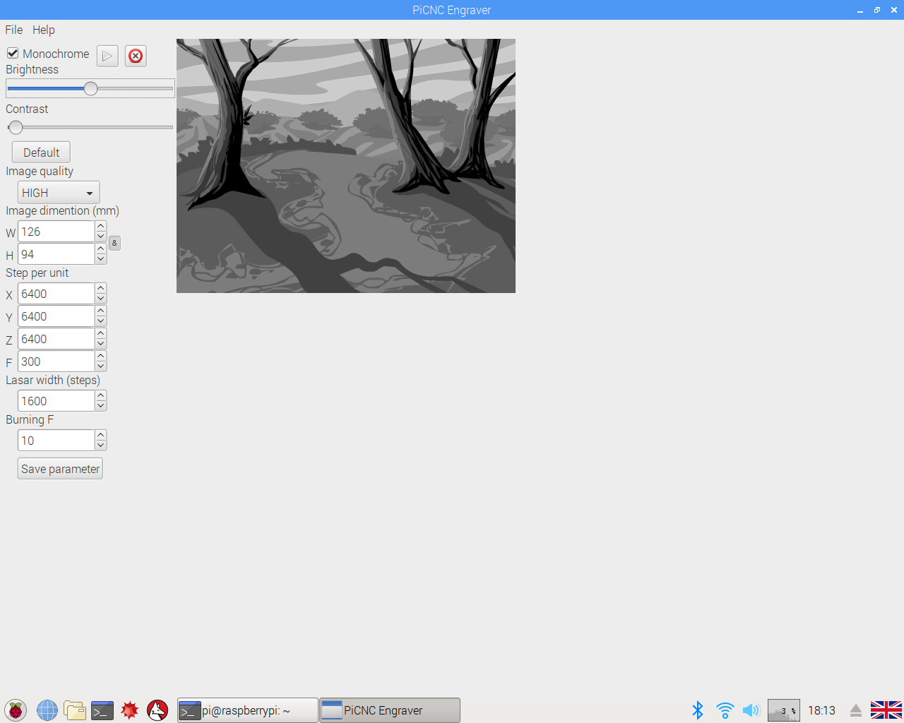
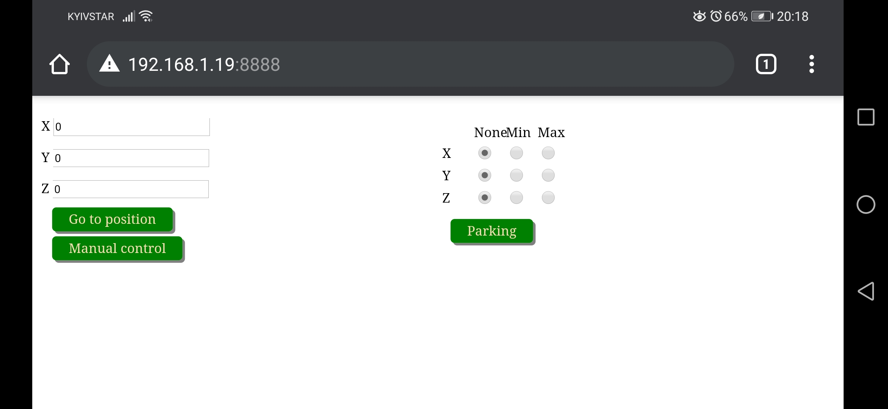
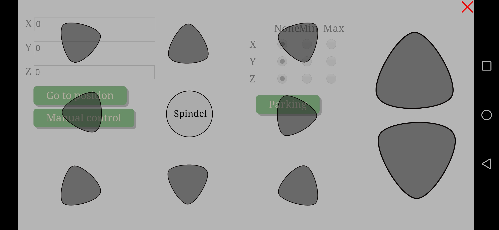

# PiCNC

Raspberry pi CNC machine.

This project consist of three parts: PiCNC main program, PiCNCEngraver for engrave bitmap images and PiCNCServer for controlling machine from mobile phone over wifi.

Each this part interacts whith kernel module that directly manage stepper motors over his drivers.

All this programs written and tested only on raspberry pi 3 model B.

<b>PiCNC interface</b> 

<b>PiCNCEngraver interface</b> 

<b>PiCNCServer (mobile) web interface</b> 

<b>PiCNCServer (mobile) web interface interface</b> 

<b>Raspberry pi pin out</b>

<pre>

XStep 19
XDir  13
XMin  6
XMax  5

YStep 16
YDir  12
YMin  7
YMax  8

ZStep 11
ZDir  9
ZMin  10
ZMax  22

Spdl  18
</pre>
<h2>Installation</h2>
<h3>User space</h3>
  1. Download <a href="https://github.com/Michael1313/PiCNC/releases/tag/v1.0-1">installation package.</a> 
  2. Open a terminal and go to package folder. 
  <code>cd /package folder</code> 
  3. Make 
  <code>dpkg -i PiCNC.deb</code> 
  <i style="color:#9E9E9E;">to remove PiCNC user space programms mack:</i> 
  <i style="color:#9E9E9E;"><code>dpkg -r PiCNC</code></i> 
  By default the PiCNCServer installing in "/usr/bin" directory. And You can run the server with the icon in main manu. Or start the server automaticly at the boot time, please folove <a href="https://www.dexterindustries.com/howto/run-a-program-on-your-raspberry-pi-at-startup/">this guide.</a>
<h3>Kernel space</h3>
Today the project does not support the latest version of the kernel so there is no chance that this module is right for you. In any case, you can compile the module yourself. 
To automatically load the module while booting the operating system, follow these steps: 
1. Add module name (picnc.ko) to: 
/etc/modules 
<code>sudo nano /etc/modules</code> 
2. Add "picnc.ko" file to 
/lib/modules/(uname -r) 
<code>cp /module/folder/picnc.ko /lib/modules/(uname -r)</code> 
3. cd to "/lib/modules/(uname -r)" and make: 
<code>depmod -a</code> 
 
<b>If you are interested in this project and you have ideas for its further development, please write to me by e-mail mbajor1313@gmail.com.</b>
